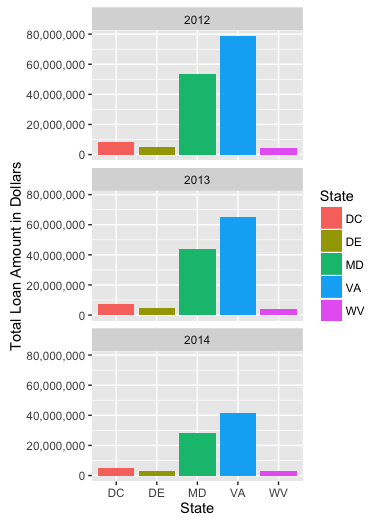
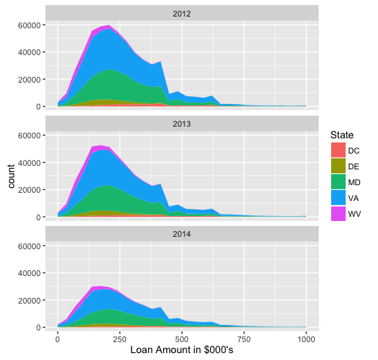

HDMA Data Challenge
-------------------

### 1. Data Munging

Create a simple function that will be called to merge the two csv files:

    hdma_init<-function(file1, file2){
      merged<-merge(file1, file2)
      return(merged)}

Read in the two csv files:

    institutions_file <-read.csv("2012_to_2014_institutions_data_campus.csv", stringsAsFactors = FALSE, header = TRUE)
    loan_file<-read.csv("2012_to_2014_loans_data_campus.csv", stringsAsFactors = FALSE, header = TRUE)

Return an object containing the expanded HDMA data:

    expanded_csv<-hdma_init(institutions_file, loan_file)

Write the expanded HDMA data to a new csv file:

    write.csv(expanded_csv, file="hdma_expanded.csv")

### 2.Visualizations

Import the expanded csv file:

    dataframe<-read.csv("hdma_expanded.csv", stringsAsFactors = FALSE)

Filter the data using dplyr:

    filtered<-dataframe%>%select(Loan_Amount_000, State, As_of_Year)%>%filter(!is.na(Loan_Amount_000), !is.na(State), !is.na(As_of_Year))%>%group_by(State, As_of_Year)%>%summarize(count=n())

#### Loan amount by state and year

The following ggplot code is use to produce the bar graph:

    ggplot(data = filtered, mapping = aes(State,Loan_Amount_000, fill=State)) + coord_cartesian() + facet_wrap(~As_of_Year, nrow=3) + geom_bar(stat="identity") + ylab("Total Loan Amount in Dollars")

##### Interpretation of the data

There is a significant decrease in the total loan amounts between 2012
to 2013 and 2013 to 2014 for all states in this data set.

#### Number of Loans by State and Year

The following ggplot code is use to produce the area graph:

    ggplot() + coord_cartesian() + scale_x_continuous() + scale_y_continuous() + facet_wrap(~As_of_Year,nrow=3) + layer(filtered, mapping = aes(Loan_Amount_000, fill=State), stat="bin", geom="area", position="stack") + xlim(0,1000) + xlab("Loan Amount in $000's") 

##### Interpretation of the data

The number of loans decreased between 2012 to 2013 and 2013 to 2014.
West Virginia and Virginia experienced the most significant change with
roughly half as many loans in 2014 relative to 2012.
