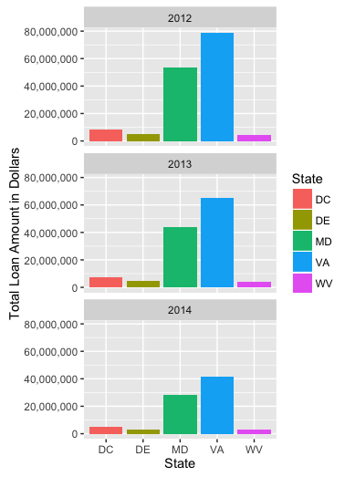
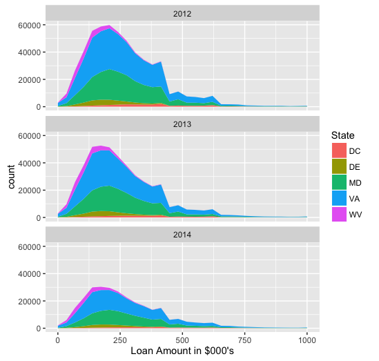

##HDMA Data Challenge
Download instructions for expanded csv file:
[Link to Expanded CSV](https://www.dropbox.com/s/j7jtz42k315xu4n/hdma_expanded.csv?dl=0)

###Visualizations
Import the expanded csv file:
```{r, eval=FALSE}
dataframe<-read.csv("hdma_expanded.csv", stringsAsFactors = FALSE)
```
Filter the data using dplyr:
```{r, eval=FALSE}
filtered<-dataframe%>%select(Loan_Amount_000, State, As_of_Year)%>%filter(!is.na(Loan_Amount_000), !is.na(State), !is.na(As_of_Year))%>%group_by(State, As_of_Year)%>%summarize(count=n())
```

####Loan amount by state and year
The following ggplot code is use to produce the bar graph:
```{r, eval=FALSE}
ggplot(data = filtered, mapping = aes(State,Loan_Amount_000, fill=State)) + coord_cartesian() + facet_wrap(~As_of_Year, nrow=3) + geom_bar(stat="identity") + ylab("Total Loan Amount in Dollars")

```


####Number of Loans by State and Year
The following ggplot code is use to produce the area graph:
```{r, eval=FALSE}
ggplot() + coord_cartesian() + scale_x_continuous() + scale_y_continuous() + facet_wrap(~As_of_Year,nrow=3) + layer(filtered, mapping = aes(Loan_Amount_000, fill=State), stat="bin", geom="area", position="stack") + xlim(0,1000) + xlab("Loan Amount in $000's") 
```


#####Interpretation of the HDMA data
There was a significant decrease in loan amounts between 2012 to 2014 for all states in this region. Also, the number of loans decreased significantly during this time period. The most dramatic change is seen in West Virginia and Virginia, which had roughly half as many loans in 2014 relative to 2012. 


