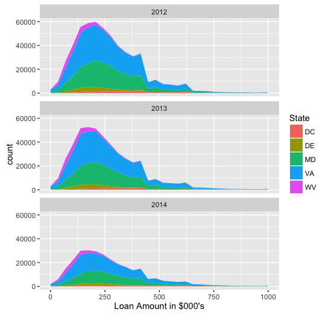

HDMA Data Challenge
-------------------

Download instructions for expanded csv file: [Link to Expanded
CSV](https://www.dropbox.com/s/j7jtz42k315xu4n/hdma_expanded.csv?dl=0)

### Visualizations

Import the expanded csv file:

    dataframe<-read.csv("hdma_expanded.csv", stringsAsFactors = FALSE)

Filter the data using dplyr:

    filtered<-dataframe%>%select(Loan_Amount_000, State, As_of_Year)%>%filter(!is.na(Loan_Amount_000), !is.na(State), !is.na(As_of_Year))%>%group_by(State, As_of_Year)%>%summarize(count=n())

#### Loan amount by state and year

The following ggplot code is use to produce the bar graph:

    ggplot(data = filtered, mapping = aes(State,Loan_Amount_000, fill=State)) + coord_cartesian() + facet_wrap(~As_of_Year, nrow=3) + geom_bar(stat="identity") + ylab("Total Loan Amount in Dollars")

#### Number of Loans by State and Year

The following ggplot code is use to produce the area graph:

    ggplot() + coord_cartesian() + scale_x_continuous() + scale_y_continuous() + facet_wrap(~As_of_Year,nrow=3) + layer(filtered, mapping = aes(Loan_Amount_000, fill=State), stat="bin", geom="area", position="stack") + xlim(0,1000) + xlab("Loan Amount in $000's") 

##### Interpretation of the HDMA data

There was a significant decrease in loan amounts between 2012 to 2014
for all states in this region. Also, the number of loans decreased
significantly during this time period. The most dramatic change is seen
in West Virginia and Virginia, which had roughly half as many loans in
2014 relative to 2012.
